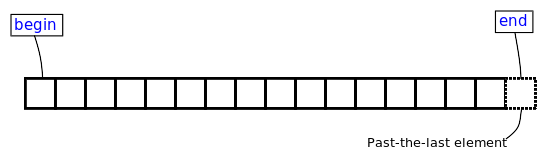

注意：本学期 CS101 PA 的所有 C++ 代码都采用 C++20 标准。如果您使用 GCC 或 Clang，您需要在编译时设置 `-std=c++20` 。如果您看到类似这样的报错

```
g++-9: error: unrecognized command line option ‘-std=c++20’; did you mean ‘-std=c++2a’?
```

说明您的编译器版本过低，请安装更高版本的编译器。目前 GCC 13 几乎已经将 C++20 除 modules 外的全部新特性实现完毕，我们推荐使用 GCC 13。

# Problem 1. Singly-linked list

本题采用中文描述。

## 目录

- [Problem 1. Singly-linked list](#problem-1-singly-linked-list)
  - [目录](#目录)
  - [开始](#开始)
  - [`SlistNode` 类](#slistnode-类)
  - [`SlistIterator` 类](#slistiterator-类)
  - [`Slist` 类](#slist-类)
    - [`Slist` 的构造函数](#slist-的构造函数)
    - [`Slist` 的拷贝控制成员](#slist-的拷贝控制成员)
    - [`Slist` 的迭代器](#slist-的迭代器)
    - [`Slist` 的维护性操作](#slist-的维护性操作)
    - [`Slist` 的比较运算符](#slist-的比较运算符)
    - [特殊操作](#特殊操作)
  - [建议实现顺序](#建议实现顺序)
  - [总结](#总结)
  - [提交与评分](#提交与评分)
  - [附录](#附录)
    - [`requirements.cpp`](#requirementscpp)
    - [`std::unique_ptr`](#stdunique_ptr)
    - [完美转发](#完美转发)

## 开始

在本题中，您需要按照 C++ STL 容器的规范实现一个模板化的链表类 `Slist` 及其迭代器 `SlistIterator` 。

首先，请去 Piazza Resources 下载本题所需的文件。下发的文件结构如下

```
.
└── attachments/
    ├── tests/
    │   ├── assignments.cpp
    │   ├── begin_end.cpp
    │   ├── constructors.cpp
    │   ├── ctor_value_init.cpp
    │   ├── emplace_after.cpp
    │   ├── erase_after.cpp
    │   ├── front.cpp
    │   ├── insert_after.cpp
    │   ├── merge.cpp
    │   ├── no_copy_or_move_type.cpp
    │   ├── only_copy_constructible_type.cpp
    │   ├── size_empty.cpp
    │   ├── sort.cpp
    │   └── special_member_count.cpp
    ├── requirements.cpp
    ├── slist_node.hpp
    └── slist.hpp
```

其中，`slist.hpp` 是您需要完成和提交的文件，这里包含了链表的迭代器类 `SlistIterator` 和链表类 `Slist` 的定义，并且 `#include` 了 `slist_node.hpp` 。 `slist_node.hpp` 里定义了链表的结点类 `SlistNode` ，您不能修改这部分代码，也不需要提交这个文件，我们会在 OJ 上提供。

当您写完代码之后，您可以编译 `requirements.cpp` 来对您的链表和迭代器的各个接口作初步的检验（阅读[附录-`requirements.cpp`](#requirementscpp)来获取关于这个文件的详细解释）。注意，我们已经将您需要写的所有函数声明正确地给出来了，所以在您什么都没写的时候 `requirements.cpp` 应当是能编译通过的。

`tests/` 文件夹下是我们提供的一些简单的测试程序，基本覆盖了您要实现的全部功能。这些代码大多数来自于 [cppreference `forward_list`](https://en.cppreference.com/w/cpp/container/forward_list) 文档里的 examples ，当然也有一些是我们单独提供的（如 `no_copy_or_move_type.cpp` ）。我们强烈建议您在提交之前先过一遍这里的测试程序，并且有针对性地编写一些额外的测试。我们不提供这些测试程序的正确输出结果，因为它们都非常简单，您应当有能力判断其正确性。

下面我将完整地向您介绍这个程序里的每一段代码。**注意，我们建议您按照[这一节](#建议实现顺序)所写的顺序来完成本题的各个函数，而不是按照下面的介绍顺序。**

## `SlistNode` 类

链表的结点类 `SlistNode` 定义在文件 `slist_node.hpp` 中。

这是一个类模板，模板参数 `T` 表示链表的结点上存储的元素的类型。链表的结点包含两样东西：

1. 指向下一个结点的指针 `next` ，类型为 `std::unique_ptr<SlistNode<T>>` ；
2. 当前结点所存储的元素 `value` ，类型为 `T` 。

如果您不清楚什么是 `std::unique_ptr` ，请看[附录-`std::unique_ptr`](#stdunique_ptr)。

`SlistNode` 定义了一个构造函数，它接受一个 `std::unique_ptr<T> &&` 类型的参数 `nxt` 和一串任意类型的参数 `args...` ，用 `std::move(nxt)` 初始化 `next` ，并将 `args...` 完美转发给 `T` 类型的构造函数来初始化 `value` 。由于 `std::unique_ptr` 是 move-only type ，我们必须用这种方式（这也是最好的方式）来初始化 `next` 成员。如果您不清楚什么是完美转发，请看[附录-完美转发](#完美转发)。

注意，由于 `SlistNode` 有一个 user-provided constructor ，编译器不会为它合成 default constructor 。又因为它有一个不可拷贝的 `std::unique_ptr<SlistNode<T>>` 类型的成员，它的 copy constructor 和 copy assignment operator 都是不可用的（implicitly deleted）。所以 `SlistNode<T>` 不可拷贝，并且仅在 `T` 可以从右值构造的情况下可移动。

注意，您不能对链表结点所存储的元素类型 `T` 的特征作任何假定，它不一定能默认构造，不一定能拷贝，不一定能移动。

## `SlistIterator` 类

`SlistIterator` 是链表的迭代器类，定义于 `slist.hpp` 中。

这是一个类模板，模板参数 `T` 表示链表的结点上存储的元素的类型，模板参数 `IsConst` 表示这个迭代器是不是 *constant iterator* 。相比于正常的迭代器，一个 *constant iterator* 不允许通过它修改它所指向的元素，比方说它的解引用运算符 `operator*()` 返回的是 `const T &` 而非 `T &` 。

按照 STL 的规范，一个迭代器通常需要声明以下五个类型别名成员（这里您只需要认识 `reference` ）：

| 名字                | 含义                     | `SlistIterator<T, IsConst>` 中的定义          |
| ------------------- | ------------------------ | --------------------------------------------- |
| `value_type`        | 指向的元素的类型         | `T`                                           |
| `difference_type`   | 两个迭代器的距离的类型   | `std::ptrdiff_t`                              |
| `reference`         | 对它所指向的元素的引用   | `IsConst` 为真时是 `const T &` ，否则是 `T &` |
| `pointer`           | 指向它所指向的元素的指针 | `IsConst` 为真时是 `const T *` ，否则是 `T *` |
| `iterator_category` | 迭代器型别               | `std::forward_iterator_tag`                   |

链表的迭代器内部持有一个指向结点的指针，名为 `m_node` 。这个指针只能是裸指针 `SlistNode<T> *` ，而非 `std::unique_ptr<SlistNode<T>>` ，因为它并不“拥有”它所指向的结点，仅仅是“观察”那个结点。它无权干涉结点的生命期。

`SlistIterator<T, IsConst>` 的构造函数如下：

1. 默认构造函数
   
   ```cpp
   SlistIterator() = default;
   ```
   
   它将 `m_node` 初始化为空指针 `nullptr` 。这样构造出的迭代器被用来表示“尾后”迭代器。`Slist<T>::end()` 返回的就是这样的迭代器。

2. 接受一个指向结点的指针，表示这个迭代器应该指向的位置。为了方便，它接受 `std::unique_ptr` 。

   ```cpp
   explicit SlistIterator(const std::unique_ptr<SlistNode<T>> &up)
       : m_node{up.get()} {}
   ```

3. 允许“添加底层 `const` ”的类型转换，即允许用一个 `SlistIterator<T, false>` 构造一个 `SlistIterator<T, true>` 。您不需要理解这个函数（以及 `isAddingLowLevelConst` ）的实现。
   
   ```cpp
   template <typename Other>
     requires isAddingLowLevelConst<std::decay_t<Other>>
   SlistIterator(Other &&other) : m_node{other.base()} {}
   ```

4. `SlistIterator<T, IsConst>` 具有编译器合成的 copy constructor 和 move constructor，它们的行为就是拷贝初始化 `m_node` ，是 trivial 的。

`SlistIterator<T, IsConst>` 还具有编译器合成的 copy assignment operator 和 move assignment operator ，它们的行为就是为 `m_node` 赋值，是 trivial 的。

`SlistIterator<T, IsConst>::base()` 的作用是返回 `m_node` 的值，即它所指向的结点的地址。**您会需要使用这个函数的。**

以下是您需要实现的成员函数。注：这部分非常简单，也和 CS101 课程内容没什么关系，仅仅是为了让您熟悉这个迭代器的使用和行为，以便后面实现 `Slist` 的相关操作时能更得心应手。

1. 解引用运算符，返回它所指向的**元素**（注意，不是“结点”）的引用。返回值类型为先前声明过的类型别名 `reference` ，即在 `IsConst` 为真时是 `const T &` ，否则是 `T &` 。

   ```cpp
   reference operator*() const;
   ```

   与之配套的箭头运算符 `operator->()` 已经实现好了。只要您的 `operator*()` 写对，就可以保证 `iter->mem` 总是等价于 `(*iter).mem` 。

2. 前置递增运算符，让这个迭代器前进到下一个位置（即指向下一个元素），然后返回自身的引用（`*this`）。
   
   ```cpp
   self_type &operator++();
   ```

   与之配套的后置递增运算符 `operator++(int)` 已经实现好了，它先为自身作一份拷贝，然后调用前置递增运算符前进到下一个位置，再返回那个拷贝。所以它返回的迭代器仍然指向递增前的位置。

3. 相等运算符，判断两个迭代器是否指向同一个结点，也就是判断那两个结点的指针是否相等。注意，判断两个迭代器相等时，我们并不在乎它们是不是 constant iterator ，因此相等运算符是一个模板：

   ```cpp
   template <bool C> bool operator==(const SlistIterator<T, C> &other) const;
   ```

   与之配套的不相等运算符 `operator!=()` 会由编译器根据 C++20 的相关规则生成。

## `Slist` 类

`Slist` 是单向链表类（Singly-linked list），定义于 `slist.hpp` 中。这是本题的核心。

这是一个类模板，模板参数 `T` 表示链表的结点上存储的元素的类型。**注意，我们不能对 `T` 所具有的性质作任何假定，它不一定能默认构造，不一定能拷贝，不一定能移动。** 某些特定的成员函数可能依赖于 `T` 的某些性质才能实现，我们会特别说明。

按照 STL 的规范，一个容器通常需要声明以下这些类型别名成员：

| 是否需要认识 | 名字              | 含义                                     | `Slist<T>` 中的定义       |
| ------------ | ----------------- | ---------------------------------------- | ------------------------- |
| **Yes**      | `value_type`      | 链表所存储的元素的类型                   | `T`                       |
| **Yes**      | `size_type`       | 适合表示链表的元素个数的类型             | `std::size_t`             |
| No           | `difference_type` | 适合表示两个迭代器的距离的类型           | `std::ptrdiff_t`          |
| **Yes**      | `reference`       | 链表所存储的元素的类型的引用             | `T &`                     |
| No           | `const_reference` | 链表所存储的元素的类型的 `const` 引用    | `const T &`               |
| No           | `pointer`         | 链表所存储的元素的类型的指针             | `T *`                     |
| No           | `const_pointer`   | 链表所存储的元素的类型的 `const` 指针    | `const T *`               |
| **Yes**      | `iterator`        | 迭代器                                   | `SlistIterator<T, false>` |
| **Yes**      | `const_iterator`  | 不可修改元素的迭代器 (constant iterator) | `SlistIterator<T, true>`  |

`Slist<T>` 有一个成员变量 `m_head` ，其类型为 `std::unique_ptr<SlistNode<T>>` ，它是指向链表的头结点的指针。除此之外，我们不存储其它变量，包括尾结点的指针、结点的数量等。再次强调，我们大量使用 `std::unique_ptr` ，如果您对于它还不熟悉，请先去看[附录-`std::unique_ptr`](#stdunique_ptr)熟悉一下。

### `Slist` 的构造函数

`Slist<T>` 的构造函数如下：

1. 默认构造函数，将 `m_head` 初始化为不持有任何对象的 `std::unique_ptr` 。
   
   ```cpp
   Slist() = default;
   ```

2. 拷贝构造函数，接受一个参数 `const Slist &other` ，将自身初始化为 `other` 的拷贝。<u>**这个函数假定 `T` 可以拷贝初始化。**</u>
   
   ```cpp
   Slist(const Slist &other);
   ```

   每一个元素都被拷贝。拷贝构造结束后，这两个链表相互独立，对其中一个的修改不会作用于另一个上。例如：

   ```cpp
   Slist<int> a{1, 2, 3};
   Slist<int> b(a); // copy construct from `a'
   // Now the elements in `b' are {1, 2, 3}.
   b.front() = 4;
   b.push_front(5);
   // Now the elements in `b' are {5, 4, 2, 3}, while `a` is still {1, 2, 3}.
   ```

3. 移动构造函数，接受一个参数 `Slist &&other` ，将 `other` 对其所存储的元素的所有权转移给自己。
   
   ```cpp
   Slist(Slist &&other) noexcept = default;
   ```

   此处的参数名 `other` 可以省略。

4. 接受一个整数 `count` 和一个值 `value` ，将自身初始化为拥有 `count` 个元素的链表，每个元素都是 `value` 的拷贝。<u>**这个函数假定 `T` 可以拷贝初始化。**</u>

   ```cpp
   Slist(size_type count, const T &value);
   ```

   例如：

   ```cpp
   Slist<int> s(3, 5); // {5, 5, 5}
   ```

5. 接受一个整数 `count` ，将自身初始化为拥有 `count` 个元素的链表，每个元素都被*值初始化（value-initialized）*。<u>**这个函数假定 `T` 可以默认初始化。**</u>

    ```cpp
    explicit Slist(size_type count);
    ```

    例如：

    ```cpp
    Slist<int> a(3); // {0, 0, 0}
    Slist<std::string> b(5); // {"", "", "", "", ""}
    ```

    不知道怎样值初始化这些元素？看[附录-完美转发](#完美转发)。

6. 接受一对 *InputIterator* 表示一个迭代器范围 `[b, e)` ，从这个迭代器范围中获得内容进行初始化。<u>**这个函数假定 `T` 可以从一个 `V` 类型的表达式初始化，其中 `V` 是该迭代器解引用的结果类型。**</u>

   ```cpp
   Slist(std::input_iterator auto b, std::input_iterator auto e);
   ```

   例如：

   ```cpp
   std::vector v{3, 5, 6, 8};
   std::list l{1, 2, 5};
   int a[] = {42, 43, 44, 45, 56};
   Slist<int> sl1(v.begin(), v.end()); // {3, 5, 6, 8}
   Slist<int> sl2(l.begin(), l.end()); // {1, 2, 5}
   Slist<int> sl3(a + 1, a + 3); // {43, 44}
   ```

   这段代码中， `Slist<int>` 都可以省略为 `Slist` ，这是因为在 `slist.hpp` 的最后我们提供了一份针对这个构造函数的 deduction guide 。

   注意，这里对元素的初始化并不一定是拷贝，例如有一种所谓的[“移动迭代器”](https://en.cppreference.com/w/cpp/iterator/move_iterator)，其解引用运算符会返回一个右值引用，使得元素有可能被移动：

   ```cpp
   // Your implementation must allow this:
   std::vector<std::unique_ptr<int>> v = something();
   Slist<std::unique_ptr<int>> up(std::make_move_iterator(v.begin()),
                                  std::make_move_iterator(v.end()));
   ```

   注意，这一对迭代器是 *InputIterator* ，意味着它不提供 multi-pass guarantee ：下面的断言是有可能失败的。也就是说，您不能反复获取 `[b, e)` 中已经获取过的元素。

   ```cpp
   auto old_b = b;
   auto old_value = *b;
   ++b;
   assert(*old_b == old_value); // may fail for InputIterator `b'.
   ```

7. 接受一个 `std::initializer_list<T>` 进行初始化。<u>**这个函数假定 `T` 可以拷贝初始化。**</u>

   ```cpp
   Slist(std::initializer_list<T> init) : Slist(init.begin(), init.end()) {}
   ```

   例如：

   ```cpp
   Slist<int> sl1{1, 2, 3, 4, 5};
   Slist<int> sl2 = {1, 2, 3, 4, 5}; // equivalent way
   ```

   注意，这个函数的实现我们已经给出，它利用了 `std::initializer_list` 的迭代器，直接将工作转交给构造函数 6 。也许您可以从这之中获得一些启发，也用这样的方式实现某个构造函数，这样可以节省一些力气。

以上构造函数中，您需要实现的有 2, 4, 5, 6 。注意，到目前为止我们还未介绍 `push_front`, `erase_after` 等修改操作，但并不意味着您在构造函数中不能调用它们。

### `Slist` 的拷贝控制成员

`Slist<T>` 具有全部五个拷贝控制成员：拷贝构造函数，拷贝赋值运算符，移动构造函数，移动赋值运算符，析构函数。其中，拷贝构造函数需要您实现（如上文所述），拷贝赋值运算符藉由 copy-and-swap 的方式实现，两个移动操作和析构函数直接由编译器生成。

这里值得一提的是析构函数的实现：编译器生成的析构函数会析构 `m_head` ，而它是一个 `std::unique_ptr` ，它的析构函数会析构它所指向的对象，也就是头结点；头结点的析构函数会析构头结点的 `next` 指针，这也是一个 `std::unique_ptr` ，因此第二个结点也会被析构，以此类推，最终所有结点都会被自动析构。

这个析构方式听起来很聪明，但它有一个问题：这一连串的析构是递归发生的，并且递归深度是 $O(n)$ 。一般来说，在实际应用中，特别是在编写库代码时，需要避免像这样的大量的递归，因为它容易造成栈空间不足而导致灾难。但是出于教学的目的，考虑到许多同学可能很少在代码中使用过递归，**在本题中我们鼓励大家使用递归**。如果您认为某个函数采用递归实现可以简化代码，就大胆地用吧。

### `Slist` 的迭代器

`Slist` 的一组 `begin` 、 `end` 函数已经给出，其中 `begin` 返回指向首元素的迭代器， `end` 返回指向“尾后”位置的迭代器，如图所示



为了简化问题，我们不要求像 `std::forward_list` 那样实现 `before_begin()` 。

### `Slist` 的维护性操作

1. `push_front` 和 `emplace_front`
   
   ```cpp
   void push_front(const T &x) {
     emplace_front(x);
   }
   void push_front(T &&x) {
     emplace_front(std::move(x));
   }
   template <typename... Types>
   reference emplace_front(Types &&...args);
   ```

   这三个函数都在链表的头部插入一个结点，插入的新结点则成为新的头结点。 `push_front` 无返回值。 `emplace_front` 返回新创建的那个**元素**（注意，不是“结点”）的引用。
   
   - 第一个函数接受 `const T &x` 参数，新结点的元素由 `x` 拷贝初始化。
   - 第二个函数接受 `T &&x` 参数，新结点的元素从 `std::move(x)` 初始化（这可能是移动，也可能是拷贝，因为在移动操作不可用时，右值也可以拷贝）。
   - 第三个函数接受任意参数，将它们[完美转发](#完美转发)给 `T` 的构造函数来初始化新结点的元素。
   
   <u>**这些函数假定上述的初始化能够发生。**</u>

   您需要实现 `emplace_front` 。

   这里我们给出了两个 `push_front` 的实现，它们都是转而调用 `emplace_front` ，将真正的工作交给 `emplace_front` 来完成。也许您可以从这之中获得一些启发，用类似的方式实现其它某些维护性操作。

2. `pop_front`
   
   ```cpp
   void pop_front();
   ```

   将头结点删除。您需要实现这个函数。

3. `clear`

   ```cpp
   void clear() {
     m_head.reset();
   }
   ```

   清空整个链表。如果您对 `std::unique_ptr` 不是很熟悉，可以思考一下，为什么这样实现能达到目的？

4. `insert_after` 和 `emplace_after`
   
   ```cpp
   void insert_after(const_iterator pos, const T &x);
   void insert_after(const_iterator pos, T &&x);
   template <typename... Types>
   iterator emplace_after(const_iterator pos, Types &&...args);
   ```

   在 `pos` 所代表的位置**之后**插入一个新的结点。 `insert_after` 无返回值。 `emplace_after` 返回指向新创建的元素的迭代器。

   - 第一个函数接受 `const T &x` 参数，新结点的元素由 `x` 拷贝初始化。
   - 第二个函数接受 `T &&x` 参数，新结点的元素从 `std::move(x)` 初始化（这可能是移动，也可能是拷贝，因为在移动操作不可用时，右值也可以拷贝）。
   - 第三个函数接受任意参数，将它们[完美转发](#完美转发)给 `T` 的构造函数来初始化新结点的元素。
   
   <u>**这些函数假定上述的初始化能够发生。**</u>

   您需要实现这三个函数。

5. `erase_after`
   
   ```cpp
   iterator erase_after(const_iterator pos);
   iterator erase_after(const_iterator pos, const_iterator last);
   ```

   - 第一个版本删除 `pos` 所代表的位置的**后一个**结点。
   - 第二个版本删除**开区间** `(pos, last)` 内的所有结点。
   
    在删除完成之后，它们都返回指向 `pos` 所指位置的后一个结点的迭代器（如果该结点不存在，就是 `end()` ）。特别地，在第二个版本中，返回的迭代器和 `last` 指向相同的位置。

6. `empty`
   
   ```cpp
   bool empty() const;
   ```

   判断当前链表是否为空，时间复杂度 $O(1)$ 。您需要实现这个函数。

7. `size`
   
   ```cpp
   size_type size() const;
   ```

   返回当前链表所含的结点个数。您需要实现这个函数。

   注意， `Slist` 的成员变量所保存的信息非常有限，无法支持一个快速的 `size()` 的实现，因此我们允许 `size()` 具有 $O(n)$ 的时间复杂度。

8. `front`
   
   ```cpp
   reference front() { return m_head->value; }
   const_reference front() const { return m_head->value; }
   ```

   返回首元素的引用。

### `Slist` 的比较运算符

这部分只作了解即可。

`Slist<T>` 定义了两个比较运算符，分别是 `operator==` 和 `operator<=>` 。在 C++20 下，编译器能够根据这两个运算符合成 `!=`, `<`, `<=`, `>`, `>=` 这些比较运算符。

```cpp
bool operator==(const Slist<T> &other) const {
  return std::equal(begin(), end(), other.begin(), other.end());
}
auto operator<=>(const Slist<T> &other) const {
  return std::lexicographical_compare_three_way(begin(), end(), other.begin(),
                                                other.end());
}
```

### 特殊操作

除了常规的链表操作（添加、删除、迭代等）之外， `Slist<T>` 还具有两组特殊操作： `merge` 和 `sort` 。

1. `merge` 归并两个有序链表。
   
   ```cpp
   void merge(Slist<T> &other) { merge(std::move(other)); }
   void merge(Slist<T> &&other) { merge(std::move(other), std::less<>{}); }
   void merge(Slist<T> &other, auto compare) {
    merge(std::move(other), compare);
   }
   void merge(Slist<T> &&other, auto compare);
   ```

   `merge` 操作提供四个接口，其中您需要实现的是第四个，而另外三个都将实际工作转交给第四个。

   - 首先，如果 `this == &other` ，即 `other` 和自身表示同一个对象，这个函数什么都不做。
   - `compare` 定义了一个顺序：`compare` 是一个可调用对象，它接受两个参数 `(x, y)` ，返回一个 `bool` 值表示它们比较的结果。我们保证这个 `compare` 是一个**严格弱序（strict weak ordering）**，即
     - Irreflexivity: `compare(a, a)` 返回 `false` ，
     - Asymmetry: 如果 `compare(a, b)` 返回 `true` ，则 `compare(b, a)` 返回 `false` ，
     - Transitivity: 如果 `compare(a, b)` 和 `compare(b, c)` 都返回 `true` ，则 `compare(a, c)` 返回 `true` 。
     
     给定 `compare` 的情况下，我们说一个链表是**有序**的，指的是对于链表中的任意两个元素 `x` 和 `y` ，如果 `compare(x, y)` 返回 `true` ，那么 `x` 必然排在 `y` 的前面。
     
     `merge` 操作的前提是 `*this` 和 `other` 都是在给定 `compare` 的情况下**有序**的，否则是未定义的行为。
     
     例如，如果 `compare` 是 `[](const T &x, const T &y) { return x < y; }` ，就相当于要求 `*this` 和 `other` 里的元素都是已按非递减顺序排序的。
    
   - `merge` 函数将 `other` 归并入 `*this` ，使得 `*this` 成为一个包含来自两个链表的所有结点的有序链表，而 `other` 成为一个空链表。注意，这个归并的过程**不能拷贝或移动任何元素**，只能通过修改结点之间的指向关系完成。不能假定 `T` 是可拷贝的或者可移动的。
   - 这个归并需要是 **stable** 的：
     - 如果有一对相等的元素分别来自 `*this` 和 `other` ，归并完毕后那个来自 `*this` 的必须排在另一个的前面；
     - 如果有一对相等的元素来自同一个链表，归并完毕后它们的相对顺序不变。
   - 这个归并的时间复杂度是 $O(n)$ ，其中 $n$ 是两个链表的元素个数之和。额外空间复杂度是 $O(1)$ 。
  
   **提示：合理使用 `std::unique_ptr<T>::swap` ，有奇效。我们只用了 9 行就完成了这个函数。**

2. `sort` 对当前链表排序。
   
   ```cpp
   void sort() { sort(std::less<>{}); }
   void sort(auto compare);
   ```

   `sort` 函数提供两个接口，我们让第二个完成实际的工作，这也是您需要实现的那一个。

   与 `merge` 中的 `compare` 相同，这里的 `compare` 也定义了一个严格弱序。在 `sort` 执行完毕后，对于链表中的任意两个元素 `x` 和 `y` ，如果 `compare(x, y)` 返回 `true` ，则 `x` 必然排在 `y` 的前面。

   `sort` 需要在 $O(n\log n)$ 的时间内完成，并且使用不超过 $O(\log n)$ 的额外空间。

   `sort` 需要是 **stable** 的：相等的元素的相对顺序在排序前后不应发生改变。

   `sort` 不能拷贝或移动任何元素，只能通过修改结点之间的指向关系完成。不能假定 `T` 是可拷贝的或者可移动的。

## 建议实现顺序

建议按照以下顺序完成本题：

1. 迭代器的三个函数。
2. `push_front`, `emplace_front` 和 `pop_front` 。这几个函数会让您对创建结点、删除结点的方式有一个基本的认识。
3. `insert_after`, `emplace_after`, `erase_after` 。
4. `empty`, `size`
5. `Slist` 的构造函数。您可以充分利用前面已经编写好的插入、删除操作，轻松完成构造函数。
6. `merge`, `sort` 。

## 总结

所有需要实现的函数都已经在代码中标上 `// TODO: IMPLEMENT THIS.` 。除去这些函数之外，您可以添加一些辅助函数或辅助类，但请不要修改已有的代码。如果您的确有更好的设计（比如尝试实现 `before_begin` ）但无法在 OJ 上通过编译，可以联系助教。

所有内存管理均使用 `std::unique_ptr` 完成，您需要保证没有内存泄漏，但是**不可以使用 `delete`** 或其它类似的方式手动释放内存。

在不改变空行、缩进格式的情况下，我们最终完成的 `slist.hpp` 不超过 240 行，每个维护性操作基本都在 3 行以内。您可以将这个数据作为参考，努力写出简洁的代码。

面对未知的模板类型参数时，请不要随意假定它是可以默认构造、拷贝构造、移动构造、拷贝赋值、移动赋值的；对于那些必须拷贝或移动元素的操作，也请将拷贝或移动的次数降到最低，不要随意假定拷贝或移动是廉价的。

## 提交与评分

在 OJ 上提交 `slist.hpp` 内的全部内容。

本题的评分由 OJ 分数（60%）和线下 check （40%）两部分构成。线下 check 会在此次作业结束时间之后进行。

注：线下 check 也带有检查学术诚信的含义，当然这不是唯一的手段。如果被认定为抄袭， OJ 的分数也会作废，并且会有惩罚。**特别强调，抄袭来自 generative AI 的代码和抄袭网上的代码是同等处理的，我们建议您在写作业时关闭一切 generative AI 工具。**

测试点信息：

0. 接口编译检查
1. 样例
2. 迭代器
3. 构造函数
4. `push_front`, `emplace_front`, `pop_front`
5. `push_front`, `emplace_front`, `pop_front` 压力测试
6. `insert_after`, `emplace_after`, `erase_after`
7. `insert_after`, `emplace_after`, `erase_after` 压力测试
8. 检查各项操作中对元素的拷贝、移动的次数
9. `merge`
10. `merge` stability
11. `merge` 压力测试
12. `sort`
13. `sort` stability
14. `sort` 压力测试

## 附录

### `requirements.cpp`

这份代码采用 C++20 Concepts 列出了 `SlistIterator` 和 `Slist` 应当满足的一些特征，比如它们应该声明了哪些类型别名成员、各个成员函数应该可以怎样被调用等等。例如，如果您不小心删除了 `SlistIterator` 类的 `using value_type = T;` 这一类型别名成员声明，使用 GCC 13 编译 `requirements.cpp` 后您将看到这样的报错：

```
requirements.cpp:261:32: error: static assertion failed
  261 | static_assert(iterator_checks::Correct<SlistIterator>);
      |               ~~~~~~~~~~~~~~~~~^~~~~~~~~~~~~~~~~~~~~~
requirements.cpp:261:32: note: constraints not satisfied
requirements.cpp:74:9:   required for the satisfaction of ‘MemberTypesCorrectOnImpl<Iterator<T, true>, T, true>’ [with T = EmptyType; Iterator = SlistIterator]
requirements.cpp:91:9:   required for the satisfaction of ‘MemberTypesCorrectOn<Iterator, EmptyType>’ [with Iterator = SlistIterator]
requirements.cpp:75:5:   in requirements  [with IterInstance = SlistIterator<EmptyType, true>]
requirements.cpp:76:16: note: the required type ‘typename IterInstance::value_type’ is invalid
   76 |       typename IterInstance::value_type;
      |       ~~~~~~~~~^~~~~~~~~~~~~~~~~~~~~~~~~
cc1plus: note: set ‘-fconcepts-diagnostics-depth=’ to at least 2 for more detail
```

然而，GCC 在这方面的表现有时并不令人满意。如果删除 `SlistIterator::operator->()` 这个函数的 `const` qualifier ，GCC 的报错似乎没有追究到底（哪怕设置了 `-fconcepts-diagnostics-depth=100` 也是如此），它在遇到 fold expression 的时候就不再追究下去了：

```
requirements.cpp:261:32: error: static assertion failed
  261 | static_assert(iterator_checks::Correct<SlistIterator>);
      |               ~~~~~~~~~~~~~~~~~^~~~~~~~~~~~~~~~~~~~~~
requirements.cpp:261:32: note: constraints not satisfied
requirements.cpp:137:9:   required for the satisfaction of ‘InterfacesCorrectOn<Iterator, EmptyType, LargeType>’ [with Iterator = SlistIterator]
requirements.cpp:141:76: note: the expression ‘((InterfacesCorrectOnImpl<Iterator<T, true>, T, true>) && (InterfacesCorrectOnImpl<Iterator<T, false>, T, false>) && (equality_comparable_with<Iterator<T, true>, Iterator<T, false> >) && (equality_comparable_with<Iterator<T, false>, Iterator<T, true> >) && ...) [with T = {EmptyType, LargeType}; Iterator = SlistIterator]’ evaluated to ‘false’
  137 | concept InterfacesCorrectOn = ((
      |                               ~~                                            
  138 |     InterfacesCorrectOnImpl<Iterator<T, true>, T, true> &&
      |     ~~~~~~~~~~~~~~~~~~~~~~~~~~~~~~~~~~~~~~~~~~~~~~~~~~~~~~                  
  139 |     InterfacesCorrectOnImpl<Iterator<T, false>, T, false> &&
      |     ~~~~~~~~~~~~~~~~~~~~~~~~~~~~~~~~~~~~~~~~~~~~~~~~~~~~~~~~                
  140 |     std::equality_comparable_with<Iterator<T, true>, Iterator<T, false>> &&
      |     ~~~~~~~~~~~~~~~~~~~~~~~~~~~~~~~~~~~~~~~~~~~~~~~~~~~~~~~~~~~~~~~~~~~~~~~ 
  141 |     std::equality_comparable_with<Iterator<T, false>, Iterator<T, true>>)&&...);
      |     ~~~~~~~~~~~~~~~~~~~~~~~~~~~~~~~~~~~~~~~~~~~~~~~~~~~~~~~~~~~~~~~~~~~~~~~^~~~
```

它并没有提到任何有关 `operator->` 的信息。幸运的是，Clang 做到了这一点（以下省略了部分重复的报错信息）：

```
requirements.cpp:261:1: error: static assertion failed
static_assert(iterator_checks::Correct<SlistIterator>);
^             ~~~~~~~~~~~~~~~~~~~~~~~~~~~~~~~~~~~~~~~
requirements.cpp:261:15: note: because 'SlistIterator' does not satisfy 'Correct'
static_assert(iterator_checks::Correct<SlistIterator>);
              ^
requirements.cpp:147:19: note: because 'InterfacesCorrectOn<SlistIterator, EmptyType, LargeType>' evaluated to false
                  InterfacesCorrectOn<Iterator, EmptyType, LargeType>;
                  ^
requirements.cpp:138:5: note: because 'InterfacesCorrectOnImpl<SlistIterator<EmptyType, true>, EmptyType, true>' evaluated to false
    InterfacesCorrectOnImpl<Iterator<T, true>, T, true> &&
    ^
requirements.cpp:118:9: note: because 'ci.operator->()' would be invalid: 'this' argument to member function 'operator->' has type 'const SlistIterator<EmptyType, true>', but function is not marked const
      { ci.operator->() } -> std::same_as<typename IterInstance::pointer>;
        ^
1 error generated.
```

我们不清楚 MSVC 在这方面的表现。

### `std::unique_ptr`

`std::unique_ptr<T>` 是一种智能指针，它拥有并管理一个 `T` 类型的对象。当这个 `unique_ptr` 被析构时，它会自动销毁它所管理的对象并释放其内存，以此保证没有内存泄露。

例如下面这段代码中，我们使用 `new` 创建了一个 `Window` 对象之后，必须记得在不用它时手动 `delete` 来释放内存。

```cpp
class Window {
  // ...
public:
  Window(unsigned width, unsigned height, const std::string &label);
};

void run_game() {
  Window *pWindow = new Window(800, 600, "Plants vs Zombies");
  // ...
  delete pWindow;
}
```

你可能会想：这有什么难的？不就是在最后记得 `delete` 吗？——且慢，你怎么确定一定是在“最后”呢？你的代码很有可能是这个样子的：

```cpp
void run_game() {
  Window *pWindow = new Window(800, 600, "Plants vs Zombies");
  // ...
  if (condition1) {
    // ...
    return;
  }
  for (/* ... */) {
    if (condition2) {
      // ...
      return;
    }
    while (condition3) {
      if (condition4)
        throw std::runtime_error{"An error occurred."};
      // ...
    }
  }
  // ...
}
```

你需要记得在所有 `return` 和 `throw` 处都 `delete pWindow` ，这时你还能信心满满地认为你不会遗漏吗？如果现在需要管理的对象不止这一个呢？如果不止这一个函数，并且对象需要在函数之间来回传递呢？

可能更复杂的情形讨论起来有些抽象，但至少上面这段代码的问题可以轻而易举地用 `unique_ptr` 解决：

```cpp
void run_game() {
  std::unique_ptr<Window> pWindow = std::make_unique<Window>(800, 600, "Plants vs Zombies");
  // ...
  if (condition1) {
    // ...
    return;
  }
  for (/* ... */) {
    if (condition2) {
      // ...
      return;
    }
    while (condition3) {
      if (condition4)
        throw std::runtime_error{"An error occurred."};
      // ...
    }
  }
  // ...
}
```

我们只需把开头的裸指针改成 `unique_ptr` 即可。当执行到 `return` 或者 `throw` 时，函数的所有局部对象会被逐个析构，当 `pWindow` 被析构时它会自动析构它所指向的对象并释放其所占用的内存。

cppreference 描述 `std::unique_ptr` 的文档可以在[这里](https://en.cppreference.com/w/cpp/memory/unique_ptr)看到，你可以暂时忽略其中所有有关 deleter 的内容。常见的 `std::unique_ptr` 操作有以下这些：

- `std::unique_ptr<T> up;` 默认初始化一个 `std::unique_ptr<T>` ， `up` 被初始化为“不持有任何对象的指针”，就如同“空指针”。
- `std::unique_ptr<T> up(p);` ，其中 `p` 是一个 `T*` 。创建一个 `std::unique_ptr<T>` 并接管 `p` 所指向的对象。通常 `p` 会是一条 `new` 表达式： `std::unique_ptr<T> up(new T(args...));` 。
- `std::make_unique<T>(args...)` 动态创建一个 `T` 类型的对象，使用参数 `args...` 进行初始化，并返回指向这个对象的 `std::unique_ptr<T>` 。功能和上一条几乎相同。
- `std::unique_ptr<T> up(std::move(up2))` 移动构造 `up` ，让 `up` 接管 `up2` 所持有的对象， `up2` 不再持有那个对象。
- `up = std::move(up2);` 移动赋值。让 `up` 接管 `up2` 所持有的对象， `up2` 不再持有那个对象。如果 `up` 原本正持有一个对象，那个对象被销毁，其内存被释放。
  - 注： `std::unique_ptr` 是 move-only type ，不可拷贝，只能移动。
- `up.swap(up2)` 交换两个 `unique_ptr` 所持有的对象。
- `*up` 获得 `up` 所指向的对象的引用。 `up->mem` 可以访问 `up` 所指向的对象的名为 `mem` 的成员。
- `up.get()` 获得 `up` 所指向的对象的裸指针。注意，此类暴露裸指针的操作要慎用，必须确保你不会 `delete` 由 `up.get()` 传出的指针。
- `up.reset(p)` ，其中 `p` 是一个 `T*` （裸指针）。令 `up` 接管 `p` 所指向的对象。如果 `up` 原本正持有一个对象，那个对象被销毁，其内存被释放。

### 完美转发

在某些场合，我们可能需要接受一些数量和类型都不确定的参数，然后把它们都转发给另一个函数。 `std::make_unique` 就是这样一个例子，它接受任意的参数，然后将它们转发给 `T` 的构造函数：

```cpp
template <typename T>
std::unique_ptr<T> make_unique(/* parameters */) {
  return std::unique_ptr<T>(new T(/* forwarded parameters */));
}
```

参数在被转发的过程中，它的左右值和 `const` qualification 不得发生改变。例如，如果传给 `make_unique` 的参数是一个右值的 `std::string` 对象， `std::make_unique` 必须仍然将它以右值的形式转发给 `T` 的构造函数。如果传进来的是一个非 `const` 对象，转发时不得私自加上 `const` 。如果没有做到这一点，就有可能转发不到想要的构造函数：

```cpp
template <typename T, typename Arg>
std::unique_ptr<T> make_unique_fake(const Arg &arg) {
  return std::unique_ptr<T>(new T(arg));
}

std::string a = some_value(), b = some_other_value();
auto sup = make_unique_fake(a + b);
```

这里 `a + b` 作为一个右值本应该被 move ，但 `make_unique_fake` 接受它时已经将它变成了左值 `const std::string &` （而且还带 `const`），于是移动变成了拷贝。

为了实现完美转发，我们需要使用**万能引用**（universal reference）接受参数，同时为了接受任意多个任意类型的参数，我们使用可变参数模板（variadic template）。这里细节的解释略去。

```cpp
template <typename T, typename... Types>
std::unique_ptr<T> make_unique(Types &&...args);
```

这样就能保证参数在传进来的时候，没有额外的拷贝或移动，没有添加或删除 `const` qualification ，并且左右值信息仍然存在。为了转发 `args` ，我们需要使用标准库函数 `std::forward` ：

```cpp
template <typename T, typename... Types>
std::unique_ptr<T> make_unique(Types &&...args) {
  return std::unique_ptr<T>(new T(std::forward<Types>(args)...));
}
```

现在我们可以来看一看 `SlistNode` 的构造函数：

```cpp
template <typename... Types>
SlistNode(std::unique_ptr<SlistNode<T>> &&nxt, Types &&...args)
    : next(std::move(nxt)), value(std::forward<Types>(args)...) {}
```

如果我们要使用 `std::make_unique<SlistNode<T>>` 动态创建一个 `SlistNode<T>` 对象，那些用来初始化 `T` 类型的元素的参数就经历了两次完美转发：首先被 `std::make_unique` 转发给 `SlistNode<T>` 的构造函数，然后被转发给 `T` 的构造函数。

特别地，在使用可变参数模板时，参数个数可以为零。如果最终初始化 `value` 时没有任何参数，那就是在对 `value` 进行**值初始化**（value-initialization）。